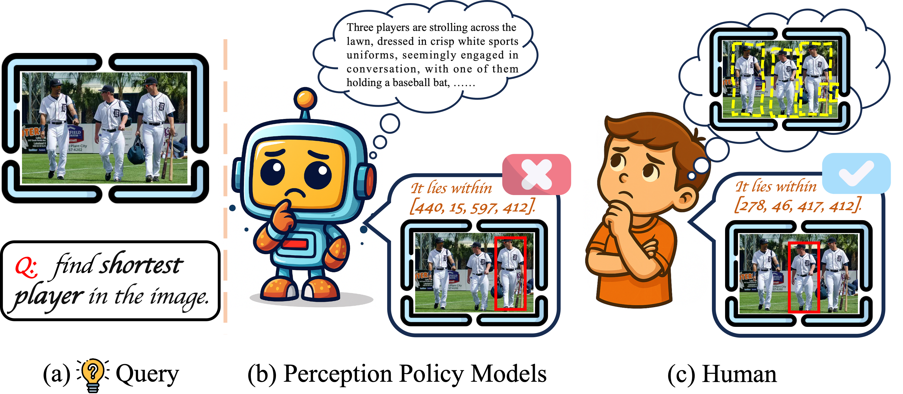
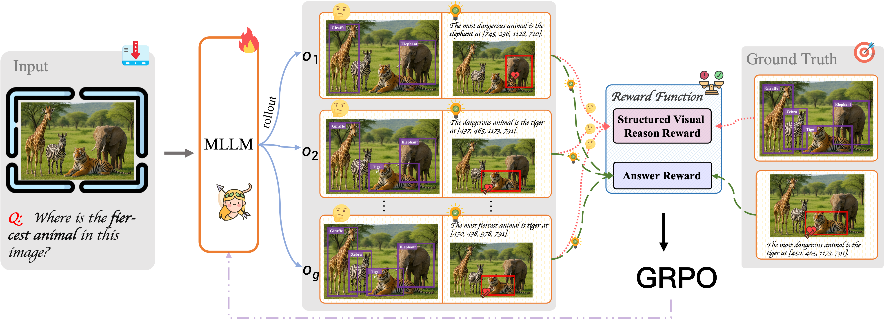

#  [Artemis: Structured Visual Reasoning for Perception Policy Learning](https://arxiv.org/pdf/2512.01988)
<!-- <p align="center" width="100%">
</p> -->

<div align="center">
    <a href="https://scholar.google.com/citations?user=D-27eLIAAAAJ&hl=zh-CN" target="_blank">Wei Tang</a><sup>1,&#8224;</sup>&emsp;
    <a href="https://scholar.google.com.hk/citations?user=a3FI8c4AAAAJ&hl=zh-CN" target="_blank">Yanpeng Sun</a><sup>2,&#8224;</sup>&emsp;
    <a href="https://scholar.google.com/citations?user=cnVvh7AAAAAJ&hl=zh-CN" target="_blank">Shan Zhang</a><sup>3,5,&#8224;</sup>&emsp;
    <a href="" target="_blank">Xiaofan Li</a><sup>4,&#42;</sup>&emsp;
    <a href="https://www.koniusz.com">Piotr Koniusz</a><sup>5</sup>&emsp;
    <a href="https://scholar.google.com/citations?user=CPd0kEMAAAAJ&hl=zh-CN">Wei Li</a><sup>6</sup>&emsp;
    <a href="https://scholar.google.com/citations?user=KOL2dMwAAAAJ&hl=zh-CN&oi=ao" target="_blank">Na Zhao</a><sup>2</sup>&emsp;
    <a href="https://scholar.google.com/citations?user=L6J2V3sAAAAJ&hl=zh-CN">Zechao Li</a><sup>1</sup>
</div>

<div align="center">
    <sup>1</sup>NJUST IMAG;&emsp;
    <sup>2</sup>SUTD IMPL;&emsp;
    <sup>3</sup>Adelaide AIML;&emsp;
    <sup>4</sup>Baidu Inc.;&emsp;
    <sup>5</sup>Data61<font color="red">&#10084;</font>CSIRO;&emsp;
    <sup>6</sup>SenseTime
    <br>
    <sup>&#42;</sup>Project Leader;&emsp;
    <sup>&#8224;</sup>ViOcean Initiative Collaborators
</div>

 
 -----------------
<a href="https://vi-ocean.github.io/projects/artemis/"></a>
<a href="https://arxiv.org/pdf/2512.01988"></a>
[](https://github.com/tatsu-lab/stanford_alpaca/blob/main/LICENSE)


## 💥 News
-  **3 Dec, 2025**: 💥💥 Artemis inference code and checkpoints have been released on GitHub and Huggingface, respectively: [🤗 Artemis-3b](https://huggingface.co/wayneicloud/Artemis).
- **2 Dec, 2025**: 💥💥 Our project homepage has been released: [Artemis homepage](https://vi-ocean.github.io/projects/artemis/).
-  **1 Dec, 2025**: 💥💥 Our paper ''Artemis: Structured Visual Reasoning for Perception Policy Learning'' has been released: [[Artemis paper](https://arxiv.org/pdf/2512.01988)].

## 📌 ToDo

- [X] Release the Artemis checkpoint.
- [X] Release the Artemis inference codes.
- [X] Release the Artemis paper of arXiv version.
- [X] Release the project homepage.
- [ ] Release Artemis-RFT dataset.
- [ ] Release all codes including training codes.

## 👀 Motivation of Artemis


Motivation of **Artemis**. Comparison between current perception-policy models and human perception. (a) Query: find the shortest player. (b) Perception–policy models depend on ungrounded language reasoning, leading to wrong localization. (c) Humans perform structured visual reasoning, progressively refining attention to identify the correct player.

## 🏆 About Artemis Framework


Recent reinforcement-learning frameworks for visual perception policy have begun to incorporate intermediate reasoning chains expressed in natural language. Empirical observations indicate that such purely linguistic intermediate reasoning often reduces performance on perception tasks. We argue that the core issue lies not in reasoning per se but in the form of reasoning: 
while these chains perform semantic reasoning in an unstructured linguistic space, **visual perception requires reasoning in a spatial and object-centric space**.
In response, we introduce **_Artemis_**, a perception-policy learning framework that performs structured proposal-based reasoning, where each intermediate step is represented as a (label, bounding-box) pair capturing a verifiable visual state. This design enables explicit tracking of intermediate states, direct supervision for proposal quality, and avoids ambiguity introduced by language-based reasoning. 
Artemis is built on Qwen2.5-VL-3B, achieves strong performance on grounding and detection task and exhibits substantial generalization to counting and geometric-perception tasks. The consistent improvements across these diverse settings confirm that aligning reasoning with spatial representations enhances perception-policy learning. Owing to its strengthened visual reasoning, Artemis also achieves competitive performance on general MLLM benchmarks, illustrating that spatially grounded reasoning provides a principled route toward scalable and general perception policies.

## 🧠 Key Innovations

- **Rethink of Perception-Policy Learning:** Instead of reasoning in linguistic space or removing the thinking process, we rethink what form of thinking truly benefits perception, and align the learning with spatial and object-centric representations.
- **Structured Visual Reasoning:** Intermediate steps are represented as (label, bounding-box) pairs, enabling explicit tracking of key and contextual objects and reducing ambiguity from language-based reasoning.
- **Cross-task Generalization:** A single perception policy transfers from grounding to counting and from natural images to diagrams, achieving scalable improvements across diverse visual tasks.

## 🎯 Structured Visual Reasoning

Artemis explicitly generates structured visual evidence during the `<think>` phase.  
By tracking intermediate states as labeled bounding boxes, the model learns to locate key and contextual objects before producing final answers.  
This approach strengthens object-centric perception, reduces ambiguity from language-based reasoning, and enables robust generalization across multiple visual domains.


## ⚙️ Install
1. Clone this repository and navigate to Artemis folder
```bash
git clone https://github.com/WayneTomas/Artemis.git
cd Artemis
```

2. Install Package
```Shell
conda create -n artemis python=3.10 -y
conda activate artemis
pip install --upgrade pip  # enable PEP 660 support
# Install PyTorch 2.5.1 with matching torchvision and torchaudio.
# You should choose the PyTorch wheel that matches your CUDA version.
# For example, if you have CUDA 12.1 installed, use the following command.
pip install torch==2.5.1 torchvision==0.20.1 torchaudio==2.5.1 --index-url https://download.pytorch.org/whl/cu121
# Install qwen-vl-utils
pip install ./qwen_vl_utils
# Install other packages
pip install -r requirements.txt
```

3. Install flash-attention v2

You can install `flash-attention` using the following command:
```bash
pip install flash-attn --no-build-isolation
```
However, if you encounter any issues with this method, we recommend downloading the specific version of the flash-attention wheel file from the [Releases page](https://github.com/Dao-AILab/flash-attention/releases) and installing it manually. For example, you can download the flash_attn-2.7.4.post2+cu12torch2.5cxx11abiFALSE-cp310-cp310-linux_x86_64.whl file and install it using the following command:
```Shell
pip install flash_attn-2.7.4.post2+cu12torch2.5cxx11abiFALSE-cp310-cp310-linux_x86_64.whl
```

### Quick Start With HuggingFace
<details>
<summary>Example Code</summary>

```Python
from transformers import Qwen2_5_VLForConditionalGeneration, AutoProcessor
from qwen_vl_utils import process_vision_info

model_path = "ckpts/Qwen2.5-VL-3B_Artemis"

assert torch.cuda.is_bf16_supported(), "GPU does not support bf16"
    dtype = torch.bfloat16

    # Load model and processor
    model = Qwen2_5_VLForConditionalGeneration.from_pretrained(
        args.model_path,
        torch_dtype=dtype,
        device_map="auto",
        attn_implementation="flash_attention_2"
    )

    model.eval()

    # this min_pixels and max_pixels must be set
    min_pixels = 56 * 56
    max_pixels = 14 * 14 * 4 * 1280
    
    processor = AutoProcessor.from_pretrained(args.model_path, use_fast=True, max_pixels=max_pixels,min_pixels=min_pixels)
    processor.tokenizer.pad_token = processor.tokenizer.eos_token
    processor.tokenizer.padding_side = "left"
```

Check out the details in `infer_artemis.py` and the example validation codes in ./val.
</details>


## 📊 Evaluation

In Artemis, we primarily focus on the perception task. For more details, please refer to the [Artemis evaluation](https://github.com/WayneTomas/Artemis/tree/master/val).  

Here we provide inference examples for **visual grounding**, **object detection**, and **visual counting**, along with the corresponding bash scripts and evaluation code.  

For other tasks and datasets used in our work, such as:  

- [LISA grounding](https://github.com/dvlab-research/LISA)  
- [MATHGLANCE](https://github.com/Vi-Ocean/MathGlance_Benchmark)  
- [MLLM general benchmarks](https://github.com/open-compass/VLMEvalKit)  

please refer to their original GitHub repositories.


## 🌈 Acknowledgements
This repository is adapted from [VLM-R1](https://github.com/om-ai-lab/VLM-R1) and [Qwen2.5-VL](https://huggingface.co/collections/Qwen/qwen25-vl).  
It also benefits from [MATHGLANCE](https://github.com/Vi-Ocean/MathGlance_Benchmark) developed by ViOcean Initiative Collaborators and [Vision-R1](https://github.com/jefferyZhan/Griffon/tree/master/Vision-R1).

Thanks for their wonderful works.

## 📚 Cite

```bibtex
@misc{tang2025artemis,
      title={Artemis: Structured Visual Reasoning for Perception Policy Learning},
      author={Tang, Wei and Sun, Yanpeng and Zhang, Shan and Li, Xiaofan and Koniusz, Piotr and Li, Wei and Zhao Na, and Li Zechao},
      year={2025},
      eprint={2512.01988},
      archivePrefix={arXiv},
      primaryClass={cs.CV},
      url={https://arxiv.org/pdf/2512.01988}, 
}
```
```
paper link: https://arxiv.org/pdf/2512.01988
```
